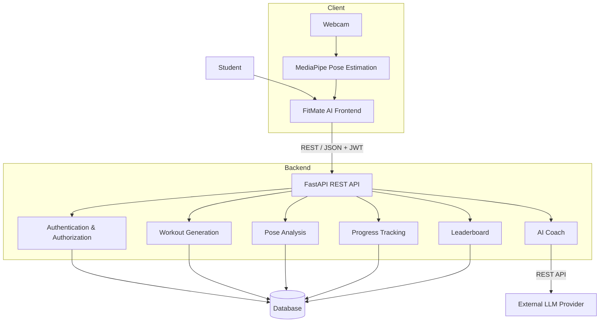
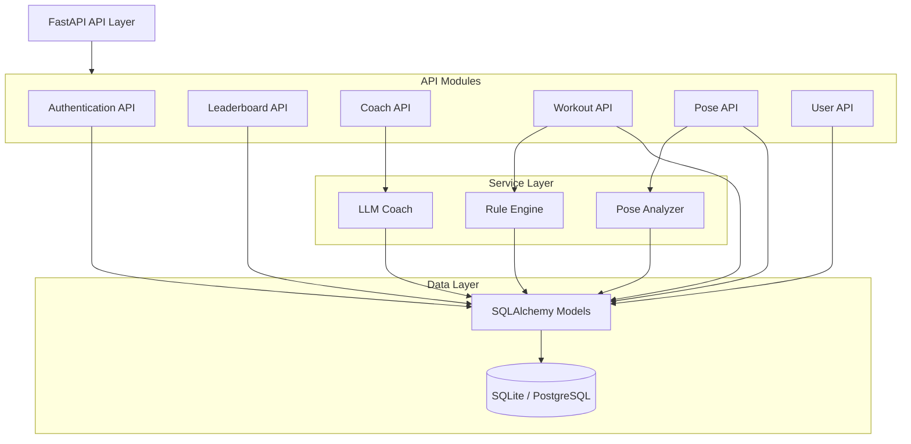
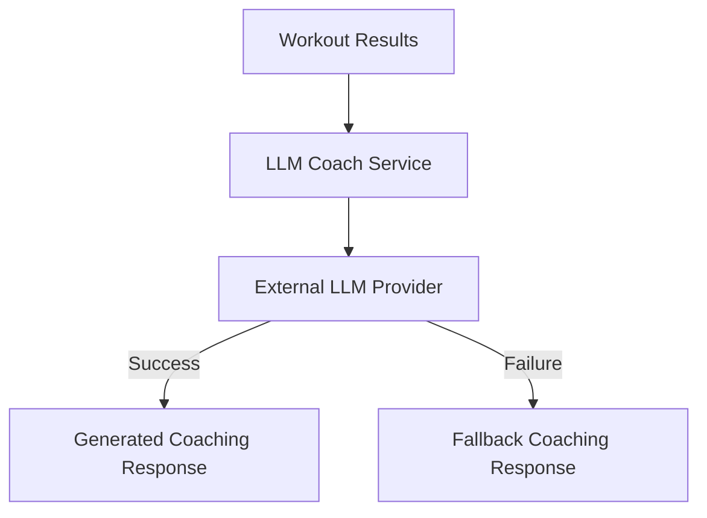
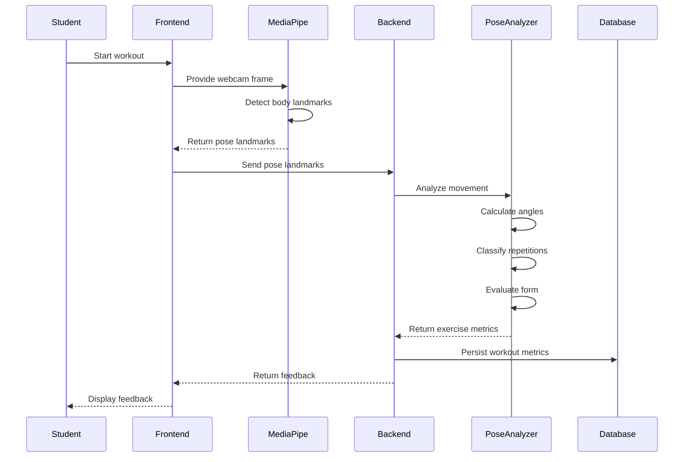
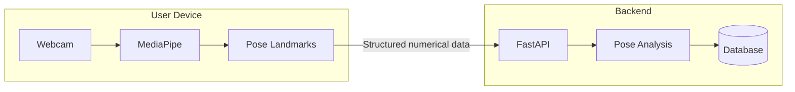
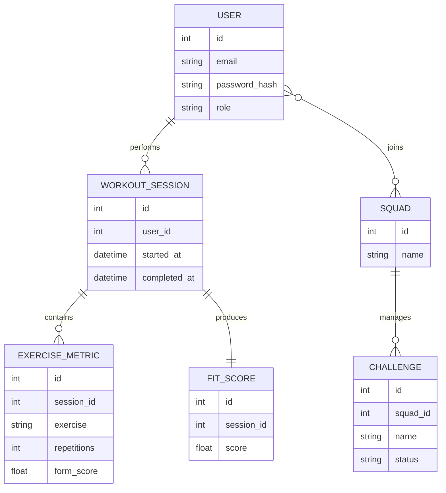
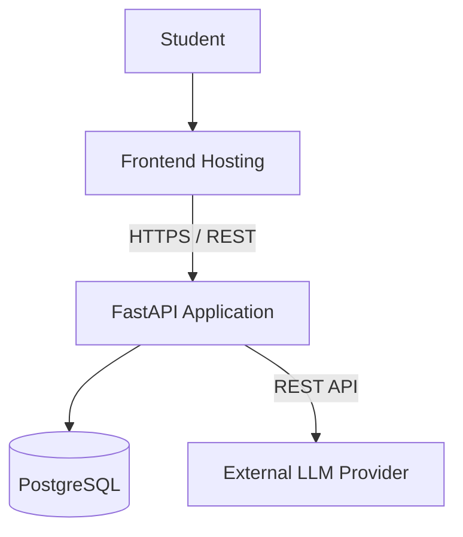

# FitMate AI — System Architecture

## 1. Document Purpose

This document defines the current system architecture of FitMate AI, including the major application layers, backend components, data flow, persistence model, security boundaries, external integrations, and deployment direction.

The document is intended to remain synchronized with the implementation. Architectural changes should be reflected here as the codebase evolves.

---

## 2. Architecture Summary

FitMate AI is a context-aware fitness platform designed for students. The system provides personalized micro-workouts, exercise analysis, progress tracking, social competition, and AI-assisted coaching.

The current architecture follows a modular client-server model:

```text
┌──────────────────────────────┐
│          Client Layer        │
│                              │
│  Web Application             │
│  Webcam                      │
│  Client-side Pose Estimation │
└──────────────┬───────────────┘
               │
               │ REST / JSON
               │ JWT
               ▼
┌──────────────────────────────┐
│         Application Layer    │
│                              │
│  FastAPI                     │
│  Authentication              │
│  Workout Generation          │
│  Pose Analysis               │
│  Progress Tracking           │
│  Leaderboards                │
│  AI Coaching                 │
└──────────────┬───────────────┘
               │
               ▼
┌──────────────────────────────┐
│       Persistence Layer      │
│                              │
│  SQLite (development)        │
│  PostgreSQL (planned)        │
└──────────────────────────────┘
```

An external LLM service is integrated with the AI coaching component.

A deliberate privacy boundary exists between the client and backend: raw webcam frames remain on the client device. The backend receives extracted pose information rather than raw video or images.

---

# 3. Architectural Principles

The system is designed around the following principles.

### 3.1 Privacy by Design

Webcam processing is performed on the client. Raw video and images are not transmitted to the backend.

Only the minimum information required for exercise analysis is sent to the server, primarily pose landmarks and derived exercise metrics.

### 3.2 Deterministic Core Logic

Core workout generation and exercise analysis are implemented using application logic rather than depending entirely on an external language model.

This keeps critical functionality predictable, testable, and available even when external AI services are unavailable.

### 3.3 Modular Monolith

The backend currently follows a modular monolithic architecture. Functional responsibilities are separated into APIs, services, models, and infrastructure components while remaining within a single deployable backend service.

This provides simpler development and deployment than a distributed microservice architecture while retaining clear internal boundaries.

### 3.4 Graceful Degradation

The AI coaching feature provides a deterministic fallback response when the external LLM service is unavailable or not configured.

The availability of the external AI provider must not prevent the core fitness application from functioning.

### 3.5 Evolutionary Architecture

The current implementation prioritizes rapid development and validation. Production-oriented capabilities such as PostgreSQL, migrations, automated testing, deployment automation, monitoring, and centralized logging are planned as the system matures.

---

# 4. System Context

The following diagram represents the primary actors and external dependencies surrounding FitMate AI.


The student interacts with the FitMate AI application through the frontend. The application communicates with the backend for authentication, workouts, exercise analysis, progress, leaderboards, and coaching functionality.

The backend communicates with the external LLM provider only for AI coaching functionality.

---

# 5. High-Level System Architecture



---

# 6. Project Structure

The current repository is organized around a backend application with a frontend being developed separately.

```text
Hackathon/
│
├── backend/
│   ├── app/
│   │   ├── api/
│   │   │   ├── coach.py
│   │   │   ├── leaderboard.py
│   │   │   └── ...
│   │   │
│   │   ├── services/
│   │   │   ├── llm_coach.py
│   │   │   ├── rule_engine.py
│   │   │   ├── pose_analyzer.py
│   │   │   └── ...
│   │   │
│   │   ├── models/
│   │   │   └── ...
│   │   │
│   │   ├── core/
│   │   │   ├── config.py
│   │   │   └── security.py
│   │   │
│   │   ├── db/
│   │   │   └── database.py
│   │   │
│   │   └── ...
│   │
│   ├── create_tables.py
│   ├── requirements.txt
│   └── Dockerfile
│
├── frontend/
│   └── ...
│
├── docs/
│   └── ...
│
├── PROJECT_CONTEXT.md
├── README.md
├── SystemArchitecture.md
└── .gitignore
```

The structure above intentionally describes the current repository rather than an idealized future structure. As additional modules are introduced, this section should be updated.

---

# 7. Client Architecture

## 7.1 Frontend Application

The frontend is responsible for the student-facing experience and client-side interaction with device hardware.

### Responsibilities

- Authentication interface
- Workout discovery and selection
- Workout execution
- Webcam access
- Client-side pose estimation
- Exercise feedback
- Progress visualization
- Leaderboard and squad views
- Communication with the backend REST API

### Planned Technologies

- React
- MediaPipe

### Current Status

The frontend is being developed separately and is not yet fully integrated with the backend.

---

## 7.2 Client-Side Pose Processing

Pose estimation is intentionally performed on the client rather than sending raw webcam video to the backend.


The backend therefore receives structured numerical information rather than raw visual media.

---

# 8. Backend Architecture

## 8.1 Backend Service

The backend is implemented as a single FastAPI application with logically separated API and service modules.

### Responsibilities

- Authentication and authorization
- User management
- Workout generation
- Pose-data ingestion
- Exercise scoring
- Progress tracking
- Squad and leaderboard management
- AI coaching

### Technology

- Python
- FastAPI
- SQLAlchemy
- JWT-based authentication
- Asynchronous database access

### Deployment Status

The backend currently runs in local development using Uvicorn.

---

# 9. Backend Component Model



---

# 10. Service Responsibilities

## 10.1 Rule Engine

**Location:** `backend/app/services/rule_engine.py`

The rule engine is responsible for deterministic workout generation.

It can use contextual information such as:

- Available workout time
- Fitness level
- Exercise requirements
- Workout constraints

The rule engine is intentionally independent of the LLM so that workout generation remains deterministic and does not require an external service.

---

## 10.2 Pose Analyzer

**Location:** `backend/app/services/pose_analyzer.py`

The pose analyzer processes pose landmark data and derives exercise performance metrics.

### Responsibilities

- Joint-angle calculations
- Movement analysis
- Repetition classification
- Form evaluation
- Exercise-specific metrics

The initial validation focus is the squat workflow. Additional exercises can be introduced after the core analysis pipeline has been validated.

---

## 10.3 LLM Coach

**Location:** `backend/app/services/llm_coach.py`

The LLM Coach provides short coaching responses based on workout results.

The LLM is an augmentation layer rather than a critical dependency for core workout execution.

### Failure Handling

If the LLM provider is unavailable, fails to respond, or an API key is not configured, the service returns a predefined fallback response.



---

# 11. Workout Execution Flow

The following sequence represents the intended workout flow from exercise initiation through feedback.



---

# 12. Data Flow

The application data flow can be divided into five primary paths.

### 12.1 Authentication Flow

```text
Student
   |
   v
Frontend Login
   |
   v
Authentication API
   |
   v
Credential Validation
   |
   v
JWT Token
   |
   v
Authenticated API Requests
```

### 12.2 Workout Generation Flow

```text
Student Context
       |
       v
Workout API
       |
       v
Rule Engine
       |
       v
Personalized Workout
       |
       v
Frontend
```

### 12.3 Pose Analysis Flow

```text
Webcam
   |
   v
MediaPipe
   |
   v
Pose Landmarks
   |
   v
Pose API
   |
   v
Pose Analyzer
   |
   v
Exercise Metrics
```

### 12.4 Progress Flow

```text
Workout Results
      |
      v
Backend
      |
      v
Persistent Metrics
      |
      v
Progress / Fit Score
      |
      v
Frontend
```

### 12.5 AI Coaching Flow

```text
Workout Results
      |
      v
LLM Coach Service
      |
      v
External LLM Provider
      |
      v
Coaching Response
      |
      v
Frontend
```

---

# 13. Privacy Architecture

Privacy is enforced through a clear boundary between client-side visual processing and backend application processing.

## 13.1 Data That Remains on the Client

- Raw webcam frames
- Raw video stream
- Camera imagery

## 13.2 Data Sent to the Backend

- Pose landmark coordinates
- Derived movement information
- Repetition information
- Exercise metrics
- Workout results



The current architecture does not require raw video transmission for exercise analysis.

---

# 14. Data Architecture

## 14.1 Database

### Development Database

SQLite is currently used for local hackathon development.

### Production Target

PostgreSQL is the planned production database.

### Database Technology

- SQLAlchemy ORM
- `aiosqlite` for asynchronous SQLite access
- Alembic planned for schema migrations

---

# 15. Logical Data Model

The current logical model contains the following primary entities:

- User
- Squad
- Workout Session
- Exercise Metric
- Fit Score
- Challenge



The diagram represents the logical model. Exact field definitions should remain synchronized with the SQLAlchemy models in the implementation.

---

# 16. API Architecture

The frontend communicates with the backend using REST APIs.

```text
Frontend
   |
   | HTTPS / REST / JSON
   | JWT
   v
FastAPI Backend
   |
   +-- Authentication
   |
   +-- Users
   |
   +-- Workouts
   |
   +-- Pose Analysis
   |
   +-- Leaderboards
   |
   +-- AI Coach
   |
   +-- Progress
```

The API layer provides the application boundary between the client and backend business logic.

---

# 17. Authentication and Authorization

## 17.1 Authentication

The backend uses JWT bearer tokens for authenticated requests.

```text
Credentials
    |
    v
Authentication Endpoint
    |
    v
Credential Validation
    |
    v
JWT Issued
    |
    v
Protected Requests
```

## 17.2 Authorization

The current role model includes:

| Role | Responsibility |
|---|---|
| `student` | Standard application user |
| `squad_admin` | Administrative privileges for squad-related operations |

Protected endpoints use the authenticated user context to enforce authorization requirements.

---

# 18. External Integrations

## 18.1 LLM Provider

The AI Coach integrates with an external LLM provider using a REST API.

### Purpose

Generate concise and encouraging coaching messages based on workout outcomes and contextual information.

### Reliability

The external provider is not treated as a mandatory dependency for the core application. A static fallback response is returned when the external integration is unavailable.

### Provider Status

The exact production provider is not yet finalized.

---

# 19. Security Considerations

## 19.1 Implemented or Planned Controls

| Area | Current State |
|---|---|
| Authentication | JWT-based |
| Authorization | Role-based |
| Raw video transmission | Not used |
| Password handling | Password hashing |
| Secrets configuration | Environment-based configuration |
| HTTPS/TLS | Production configuration pending |
| Encryption at rest | Production configuration pending |
| Database migrations | Planned |
| Centralized monitoring | Planned |

## 19.2 Security Boundary

The most important application-level security boundary is the decision not to transmit raw webcam media to the backend.

This reduces the amount of sensitive visual data that must be processed and stored by the server.

Production deployment will additionally require TLS, secure secret management, hardened database access, and appropriate operational controls.

---

# 20. Deployment Architecture

## 20.1 Current Development Environment

```text
Developer Machine
       |
       +----------------------+
       |                      |
       v                      v
 FastAPI / Uvicorn          SQLite
       |
       v
Local Development
```

The current implementation is intended primarily for local development and hackathon validation.

---

## 20.2 Planned Production Architecture



The production architecture is intentionally simple and can be extended as traffic, reliability, and operational requirements increase.

---

# 21. Development Environment

## Backend

The backend is developed using Python and FastAPI.

Uvicorn is used as the local application server.

## Database Initialization

The current database tables can be initialized using:

```bash
python backend/create_tables.py
```

## Testing

A formal automated testing suite is not yet fully established.

Planned test coverage includes:

- Unit tests for business logic
- Pose-analysis tests
- API integration tests
- Authentication and authorization tests
- End-to-end application tests

---

# 22. Technology Stack

| Layer | Technology | Purpose |
|---|---|---|
| Frontend | React | User interface |
| Pose Estimation | MediaPipe | Client-side body landmark extraction |
| Backend | Python | Application implementation |
| API Framework | FastAPI | REST API |
| ORM | SQLAlchemy | Database access |
| Authentication | JWT | User authentication |
| Development Database | SQLite | Local persistence |
| Production Database | PostgreSQL | Production persistence |
| AI Coaching | External LLM API | Coaching generation |
| Application Server | Uvicorn | Local FastAPI execution |
| Database Migrations | Alembic | Planned schema management |
| Deployment | Cloud infrastructure | Planned production hosting |

---

# 23. Current Implementation Status

| Component | Status | Notes |
|---|---|---|
| Backend API | Active | FastAPI application |
| Authentication | Implemented | JWT-based authentication |
| Authorization | Implemented | Role-based access |
| Workout Generation | Implemented | Rule-based approach |
| Pose Analysis | In Progress | Initial squat workflow |
| AI Coach | Implemented | Includes fallback behavior |
| Leaderboard | Implemented | Backend capability available |
| Database | Implemented | SQLite for development |
| Frontend | In Progress | Separate development track |
| MediaPipe Integration | In Progress | Client-side integration |
| PostgreSQL | Planned | Production migration |
| Alembic | Planned | Database migrations |
| Automated Testing | Planned | Unit and integration coverage |
| Production Deployment | Planned | Cloud environment |
| Monitoring | Planned | Operational observability |

---

# 24. Roadmap

## Phase 1 — Core Platform

- Complete backend functionality
- Stabilize authentication and authorization
- Validate workout generation
- Validate persistence and leaderboard behavior
- Validate AI coaching and fallback behavior

## Phase 2 — Computer Vision Integration

- Complete MediaPipe integration
- Validate end-to-end pose data flow
- Validate squat repetition detection
- Improve exercise form scoring
- Provide real-time exercise feedback

## Phase 3 — Product Expansion

- Add additional exercises
- Expand personalization capabilities
- Improve fitness scoring
- Expand challenges and social functionality

## Phase 4 — Production Readiness

- Migrate SQLite to PostgreSQL
- Introduce Alembic migrations
- Establish automated testing
- Deploy frontend and backend
- Configure HTTPS/TLS
- Introduce monitoring and centralized logging
- Establish CI/CD

---

# 25. Architectural Decisions

## ADR-001: Client-Side Pose Processing

**Decision:** Perform pose estimation on the client.

**Rationale:** Avoid transmitting raw webcam video to the backend and minimize sensitive visual data leaving the user's device.

---

## ADR-002: Modular Monolith for Backend

**Decision:** Keep backend functionality within a single FastAPI deployment while maintaining clear API and service boundaries.

**Rationale:** A modular monolith reduces deployment and operational complexity during early-stage development while preserving a structure that can evolve later.

---

## ADR-003: Rule-Based Workout Generation

**Decision:** Use deterministic application logic for core workout generation.

**Rationale:** Workout generation is a critical application capability and should remain predictable, testable, and independent of external AI availability.

---

## ADR-004: LLM as an Enhancement Layer

**Decision:** Use the LLM primarily for coaching and contextual natural-language feedback.

**Rationale:** External language-model availability should improve the user experience without becoming a dependency for core workout functionality.

---

## ADR-005: SQLite for Development

**Decision:** Use SQLite during hackathon development with a future PostgreSQL migration path.

**Rationale:** SQLite minimizes development and infrastructure overhead while the application is being validated. PostgreSQL is the intended production database.

---

# 26. Project Information

| Property | Value |
|---|---|
| Project | FitMate AI |
| Hackathon | Smart India Hackathon 2026 |
| Theme | Fitness & Sports |
| Category | Software |
| Primary Responsibility | Backend and System Architecture |
| Architecture Owner | Abhay |
| Last Updated | 2026-09-08 |

---

# 27. Glossary

### FitScore

A computed metric representing a user's fitness activity or workout performance.

### Rule Engine

Deterministic application logic used to generate personalized micro-workouts from contextual inputs such as available time and fitness level.

### Pose Landmark

A numerical representation of a tracked body point, such as a shoulder, hip, knee, or ankle.

### Pose Analysis

The process of evaluating movement using pose landmarks, joint angles, repetition logic, and exercise-specific rules.

### Micro-Workout

A short, personalized workout designed to fit within a student's available time.

### Squad

A group of students participating in FitMate AI's social and competitive functionality.

---

# 28. Maintenance Guidelines

This document should be updated when any of the following change:

- Application structure
- Backend modules
- Database entities
- Authentication or authorization
- External integrations
- Data flow
- Privacy boundary
- Deployment architecture
- Technology stack
- Major architectural decisions

The architecture document should represent the implementation as it exists rather than an aspirational architecture that has not yet been built.