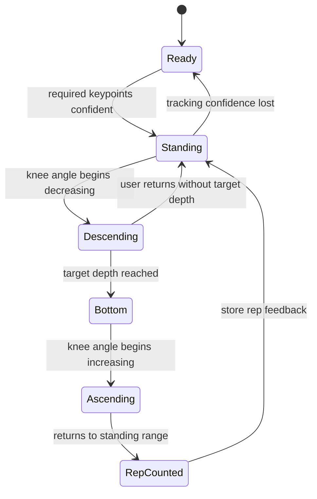

# TalentTrack Exercise Scoring Logic

> **Project status: Phase 1 design specification.**  
> This document defines the proposed logic for TalentTrack's first working prototype. It is not a claim that the live assessment has already been implemented or clinically validated.

## 1. Goal

TalentTrack will use a browser webcam and pose estimation to give athletes understandable exercise feedback. The first minimum viable feature is a **squat assessment** that can:

1. detect a complete squat movement;
2. count a valid repetition;
3. check basic movement quality; and
4. save an explainable result for progress tracking.

The system is designed as a coaching-support tool. It does not diagnose injuries, provide medical advice, or replace a qualified coach.

## 2. Proposed data flow

```text
Webcam frame
    -> Pose-estimation model
    -> Body keypoints and confidence values
    -> Joint-angle and alignment calculations
    -> Exercise state machine
    -> Rep result and form flags
    -> Session score and user feedback
    -> Saved assessment history
```

The pose model will provide coordinates and confidence values for visible body joints. The application will use those measurements in an explainable rule engine instead of asking a general-purpose AI model to give an unexplained score.

## 3. Keypoints used for squat assessment

The squat prototype will primarily use one visible side of the body. If both sides have good confidence, the system can calculate both and use an average or the more reliable side.

| Keypoint | Why it is needed |
|---|---|
| Shoulder | Estimates torso direction and lean |
| Hip | Calculates knee angle and torso direction |
| Knee | Calculates knee angle and alignment |
| Ankle | Calculates knee angle and knee-over-ankle alignment |
| Optional opposite-side joints | Improves reliability when visible |

Before analysis, the application should check that the required keypoints meet a minimum pose-confidence threshold. If confidence is too low, it should pause scoring and ask the user to improve lighting, framing, or camera position.

## 4. Core measurements

### 4.1 Knee angle

The knee angle is calculated from the hip, knee, and ankle coordinates. Let `H`, `K`, and `A` represent those points.

```text
vector1 = H - K
vector2 = A - K
kneeAngle = arccos((vector1 dot vector2) / (|vector1| * |vector2|))
```

An upright standing position has a larger knee angle. The angle becomes smaller as the athlete bends into a squat. Exact thresholds will be calibrated after testing with sample users and coach feedback.

### 4.2 Squat depth

Depth is estimated from knee angle and the vertical relationship between hip and knee. The first prototype will classify a rep as:

| Depth result | Proposed meaning |
|---|---|
| Good | Reached the target bend range consistently |
| Partial | Completed the movement but did not reach target depth |
| Unclear | Pose confidence or camera angle was insufficient |

The interface must say **"camera-based estimate"** where appropriate. It should not claim exact biomechanical measurement.

### 4.3 Knee alignment

The system compares knee position with ankle position during the low phase of the squat. Large inward drift can trigger a gentle feedback flag such as:

> Keep your knees aligned with your feet.

This is guidance based on visible 2D alignment only. It is not an injury-risk diagnosis.

### 4.4 Torso lean

The system uses the shoulder-to-hip segment relative to vertical to estimate excessive forward lean. A sustained deviation beyond a calibrated threshold can produce feedback such as:

> Keep your chest more upright if comfortable.

### 4.5 Tempo and consistency

Each rep records timestamps for descent, low position, and ascent. The system compares rep durations within the set.

| Result | Proposed interpretation |
|---|---|
| Consistent | Similar speed across most repetitions |
| Uneven | Large variation between repetitions |
| Too fast | Movement may be difficult to assess reliably |

Tempo feedback is advisory; it should not block a user from completing a session.

## 5. Squat rep state machine

The state machine avoids accidental counting from small movements, unstable tracking, or a user simply moving in front of the camera.



### Proposed pseudocode

```text
for each camera frame:
    pose = detectPose(frame)

    if requiredKeypointsAreNotConfident(pose):
        showFramingGuidance()
        pauseScoring()
        continue

    metrics = calculateSquatMetrics(pose)

    if state == STANDING and metrics.isDescending:
        state = DESCENDING
        startRepTimer()

    if state == DESCENDING and metrics.reachedTargetDepth:
        state = BOTTOM
        recordBottomMetrics(metrics)

    if state == BOTTOM and metrics.isAscending:
        state = ASCENDING

    if state == ASCENDING and metrics.returnedToStanding:
        rep = scoreRep(recordedMetrics, metrics)
        saveRep(rep)
        state = STANDING
```

## 6. Proposed rep scoring

Each completed rep receives a transparent score out of 100. This weighting is a starting design and will be refined after user testing and expert feedback.

| Component | Weight | Question answered |
|---|---:|---|
| Completion | 25 | Did the athlete complete standing → squat → standing? |
| Depth | 30 | Did the athlete reach the target range? |
| Knee alignment | 20 | Did the visible knee remain reasonably aligned? |
| Torso posture | 15 | Was torso lean within the expected range? |
| Tempo | 10 | Was the movement controlled and consistent? |

### Example feedback rules

| Condition | User-facing feedback |
|---|---|
| Good depth and stable alignment | Good depth and stable control. |
| Completed rep but insufficient depth | Try going slightly lower, while staying comfortable. |
| Knee drifts inward | Keep your knees aligned with your feet. |
| Large forward lean | Keep your chest more upright if comfortable. |
| Low keypoint confidence | Step back so your full body is visible and improve lighting. |

## 7. Session result

After the set, TalentTrack will display:

```text
Exercise: Squat
Completed reps: 8
Valid-depth reps: 6
Overall form score: 78 / 100

Strengths
- Controlled tempo
- Good depth on most reps

Improve next time
- Keep knees aligned with feet
- Aim for consistent depth
```

The backend will store the session summary, not raw webcam footage, unless a future version introduces a separate consent-based video feature.

## 8. Extension plan

After a reliable squat prototype, the same approach can be adapted for other exercises.

| Exercise | Key checks |
|---|---|
| Push-up | Elbow bend, body-line straightness, hip sag, tempo |
| Lunge | Front-knee depth, knee-over-ankle position, torso position |
| Plank | Continuous shoulder-hip-ankle body-line straightness |
| Jumping jack | Arm range, leg spread, movement cadence |
| Vertical jump | Hip displacement estimate, landing consistency |

## 9. Limitations and safety

- A single 2D webcam cannot provide laboratory-grade biomechanics analysis.
- Lighting, camera height, loose clothing, partial body visibility, and occlusion can reduce accuracy.
- Vertical jump should be shown as an estimate, not an exact measurement.
- The system should not be used to diagnose pain, injury, or medical conditions.
- Users should stop exercising if they experience pain and seek qualified advice where appropriate.
- Testing must include diverse body types, camera angles, devices, and lighting conditions before wider deployment.

## 10. Phase 1 acceptance criteria

The first implementation milestone is complete when the team can demonstrate:

- live webcam access in the browser;
- visible pose keypoints or skeleton overlay;
- detection of standing, descent, bottom, and ascent squat states;
- correct counting of a controlled squat sequence;
- at least one explainable feedback item, such as depth;
- a saved assessment result in the database; and
- a clear low-confidence or camera-framing message when pose tracking is unreliable.
